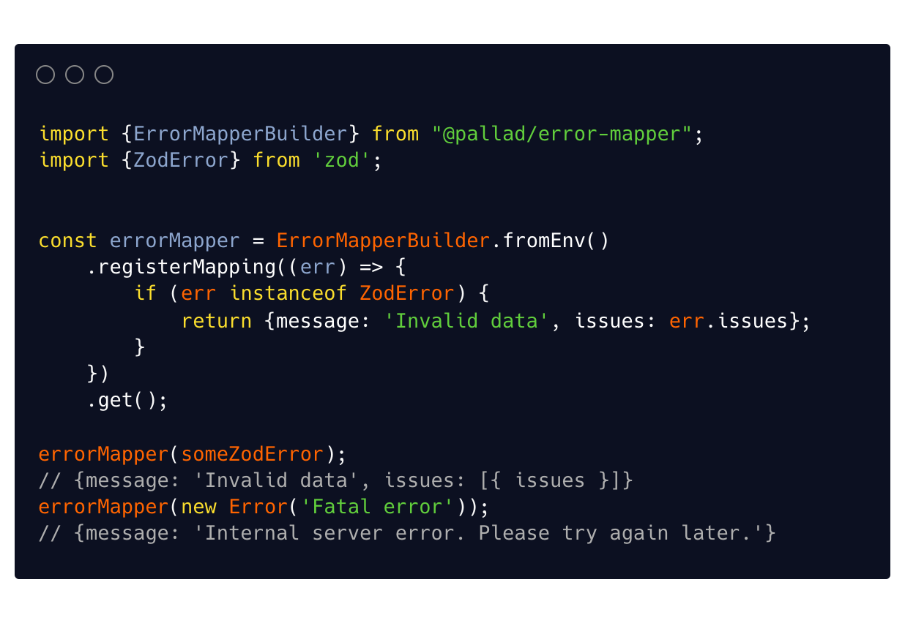

<div align="center">
<h1>error-mapper ❄️</h1>

<p>Minimal, general purpose error mapping</p>
</div>

---
[](https://circleci.com/gh/pallad-ts/error-mapper/tree/master)
[](https://badge.fury.io/js/@pallad%2Ferror-mapper)
[](https://coveralls.io/github/pallad-ts/error-mapper?branch=master)
[](https://opensource.org/licenses/MIT)
---



# Community

Join our [discord server](https://discord.gg/G5tSBYbpej)

# Installation

```shell
npm install @pallad/error-mapper
```

# Problem

Whenever errors from application are caught you need to represent them properly in the response.
For example HTTP status code needs to represented, you need to decide whether to include stack trace, how about errors
that are not thrown from your application directly but another library?

While it sounds simple this turns out to be a problematic for many.

# Solution

Have a set of rules that defines how certain error should be represented.
`error-mapper` helps with that by providing options map error to desired output in composable way, handle unknown
errors, hide error message for them depending on environment, displaying stack for development environments, allowing to
listen on unknown errors, globally format output.

# Usage and how it works

Simple example

```typescript
const errorMapper = ErrorMapperBuilder.fromEnv()
	.registerOutputTransformer((output, error) => { // decorates final output 
		if (error instanceof Error) {
			return {...output, name: error.name}
		}
		return output;
	})
	.registerMapping(error => { // decides how error should be represented
		if (error instanceof ValidationError) {
			return {
				message: 'Invalid data',
				violations: error.getViolations(),
				statusCode: 400
			}
		}
	})
	.get()


app.use((err, req, res, next) => {
	const {statusCode, ...rest} = errorMapper(err);
	res.status(statusCode ?? 500)
		.json(rest)
})
```

`ErrorMapping` is a function that receives an error and decides whether can handle it by returning desired output.

For example you might want to return validation errors or extra details about `NotFound` error.

```typescript
ErrorMapperBuilder.fromEnv()
	.registerMapping(error => {
		if (error instanceof ValidationError) {
			return {
				message: 'Invalid data',
				violations: error.getViolations() // extract validation errors like "name is too long"
			}
		}
	})
	.get()
```

`OutputFormatter` is a function that receives output from a mapper (or default output if no mapper registered) and
transforms it.
This is a good opportunity to decorate output regardless of mappers.

For example you might want to populate `name` of the error.

```typescript
ErrorMapperBuilder.fromEnv()
	.registerOutputTransformer((output, error) => {
		if (error instanceof Error) {
			return {...output, name: error.name}
		}
		return output;
	})
	.get()
```

Whenever final mapper gets called, error mappers are invoked in registration order until the one that is able to handle
the error returns an output. The output then gets formatted by registered output transformers and returned.

`error-mapper` has no idea what to do with created output and you are responsible to do whatever is needed to properly
represent data.

```typescript
app.use((err, req, res, next) => {
	const {statusCode, ...rest} = errorMapper(err);
	res.status(statusCode ?? 500) // use statusCode
		.json(rest) // and display the rest
})
```

## Conditional configuration

`error-mapper` extends [@pallad/builder](https://www.npmjs.com/package/@pallad/builder) which allows to easily configure
the builder without breaking chaining.

```typescript
ErrorMapperBuilder.fromEnv()
	.runIf(process.env.ERROR_DISPLAY_NAME === '1', (builder) => { // shouldDisplayName
		return builder.registerOutputTransformer((output, error) => {
			if (error instanceof Error) {
				return {...output, name: error.name}
			}
			return output;
		})
	})
```

## Showing stack trace

`stack` is returned only if option `showStackTrace` is set - default `false`.

When `ErrorMapperBuilder.fromEnv` is used then it is set to true for `development` and `test` environment (determined
by [@pallad/app-env](https://github.com/pallad-ts/app-env)).

```typescript 
import {ErrorMapperBuilder} from '@pallad/error-mapper';

const errorMapper = new ErrorMapperBuilder()
	.setOptions({showStackTrace: true})
	.get()

const result = errorMapper(new Error('test'))
/**
 * {stack: 'Error: test\n    at REPL6:1:1\n    at Script.runInThisContext (node:vm:129:12)'}
 */
```

## Showing unknown errors

By default unknown error (the one that has no mapper) is displayed only for `development` and `test` environment (
determined
by [@pallad/app-env](https://github.com/pallad-ts/app-env)).

Unknown error message (the one that has no mapper) is returned only if option `showUnknownError` is set -
default `false`.

When `ErrorMapperBuilder.fromEnv` is used then it is set to true for `development` and `test` environment (determined
by [app-env](https://github.com/pallad-ts/app-env)).

If set to `false` then message `"Internal server error. Please try again later."` is returned instead of original error
message.

```typescript 
import {ErrorMapperBuilder} from '@pallad/error-mapper';

const errorMapper = new ErrorMapperBuilder()
	.setOptions({showUnknownError: true})
	.get()

errorMapper(new Error('Test error message'))
/**
 * {message: "Test error message"}
 */

const errorMapper2 = new ErrorMapperBuilder()
	.setOptions({showUnknownError: false})
	.get()

errorMapper2(new Error('Test error message'))
/**
 * {message: "Internal server error. Please try again later."}
 */
```

## Callback on unknown errors

If none or registered mapping is able to handle the error you can optionally listen to them.
Listener has no effect on produced output.

```typescript
const mapper = ErrorMapperBuilder()
	.onUnknownError(error => {
		console.error('Fatal error we do not know how to handle', error);
	})
	.get()
```

# FAQ

## Type of `error` is of type `unknown`. Why is that?

While it is common sense to type it as `Error` but javascript can throw almost anything, even raw strings. In practice
turned out that not everything has to be an `Error`. Moreover `unknown` forces you to perform proper type checks.
